# 第四次作业

### 自动化少61 何奈特 2140506114

---

## 题目1&2

> 高斯滤波器（sigma=1.5）和中值滤波器平滑test1和test2，分别取模板大小3x3,5x5,7x7

* 这次作业用到了两种新位图格式pgm和tif，继续使用C++处理：

* pgm结构较为简单，（这次用到的都是pgm5型）文件开头是"P5\n"，（然后可能有一个注释行，以'#'开头）下一行有两个ASCII码给出的数字，分别为图像的高和宽（中间用空格隔开），下一行又是一个ASCII码的数字，为最大灰度值。此后就是一行一行的像素灰度数据，而且没有4B对齐的要求。

* tif全名为标签图像文件，典型的tif由文件头、数据、标签三部分依次组成。先从文件头得到标签表的位置（一般放在文件末尾），从该位置读到标签数量，随后读入这么多个12Byte的标签。每个标签由四部分依次组成：ID(2B)、数据类型(2B)、数量(4B)和地址(4B)，小标签（信息量不超过4B）的内容直接放在地址中，不占用数据空间；否则要找到文件的该地址处去取，大小根据数据类型和数量相乘算出。好在对本次任务有用的标签不多：ID为256和257的高和宽（数据直接存放在标签的第四部分），ID为273的带偏移，到其给出的地址可以读到许多个地址，对应图像的很多条“带”，因为都是连续存放的，最简单的做法是从第一个带的地址开始，直接顺序读入高乘宽个字节，对应图像的每个像素灰度值。

* test4.tif尤其复杂，其有多余的采样数据，这一点可以从277号（值为2）和338号（值为1）标签看出（其为每像素采样数和多余采样数，详见[此网站的说明](https://www.awaresystems.be/imaging/tiff/tifftags/samplesperpixel.html)）。另外，pgm和tif存储顺序与bmp上下相反，读入时应颠倒读入。

* 综合考虑以上要素可以写出pgm类和tif类，方便后续的文件读写。更进一步，可以把前面的bmp类也囊括进来，改写这三个类，共同**继承于父类Bitmap类**，其包含四个成员char name[], int height, int width和BYTE px[][]，这样大大方便了后续程序的设计，子程序只要接受Bitmap*类型的参数就好了。这些代码详见[p1&2\bitmap.cpp](p1&2\bitmap.cpp)

* 高斯滤波的模板求得如下表所示：（由[p1&2\p2.cpp](p1&2\p2.cpp)算出）

3*3

-|-|-
:--:|:--:|:--:
0.0947416|0.118318|0.0947416
0.118318|0.147761|0.118318
0.0947416|0.118318|0.0947416

5*5

-|-|-|-|-
:--:|:--:|:--:|:--:|:--:
0.0144188|0.028084|0.0350727|0.028084|0.0144188
0.028084|0.0547002|0.0683123|0.0547002|0.028084
0.0350727|0.0683123|0.0853117|0.0683123|0.0350727
0.028084|0.0547002|0.0683123|0.0547002|0.028084
0.0144188|0.028084|0.0350727|0.028084|0.0144188

7*7

-|-|-|-|-|-|-
:--:|:--:|:--:|:--:|:--:|:--:|:--:
0.00134197|0.00407653|0.00794|0.00991586|0.00794|0.00407653|0.00134197
0.00407653|0.0123834|0.0241196|0.0301217|0.0241196|0.0123834|0.00407653
0.00794|0.0241196|0.0469785|0.0586691|0.0469785|0.0241196|0.00794
0.00991586|0.0301217|0.0586691|0.0732688|0.0586691|0.0301217|0.00991586
0.00794|0.0241196|0.0469785|0.0586691|0.0469785|0.0241196|0.00794
0.00407653|0.0123834|0.0241196|0.0301217|0.0241196|0.0123834|0.00407653
0.00134197|0.00407653|0.00794|0.00991586|0.00794|0.00407653|0.00134197

* 中值滤波计算量大，这里巧用了上次作业第四题写的线段树（见[segTreeC.cpp](p1&2\segTreeC.cpp)），添加了mid方法，可以用(log(256))^2次操作求出中位数（详见[p1&2\p1.cpp](p1&2\p1.cpp)），节省了计算量，在邻域较大时也能快速计算出结果。

* **边缘都不做处理**（留黑边）。

test1|高斯|中值
--|--|--
原图|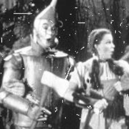|
3|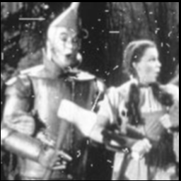|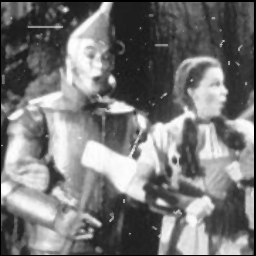
5||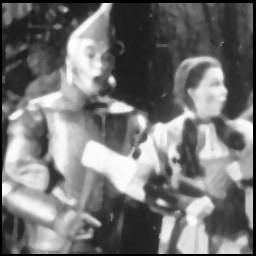
7|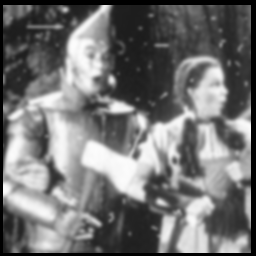|

test2|高斯|中值
--|--|--
原图||
3||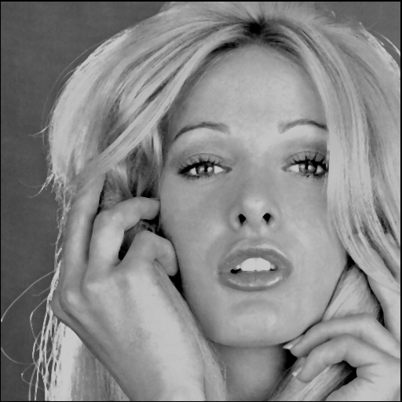
5||
7||

* 中值滤波效果更明显，也即图片的失真更严重。

---

## 题目3

> 利用高通滤波器unsharp masking, Laplace edge detection, Sobel edge detector和Canny algorithm 处理test3和test4

* 为简便，**本题都用3*3模板进行计算**。

* unsharp法需要用到模糊运算，这里直接拿来上题的3*3高斯模板，用0 0 0 0 2 0 0 0 0减去之，详见[p3\p3.cpp](p3\p3.cpp)中的gsus函数。

* laplace法模板简单（1 1 1 1 -8 1 1 1 1），但是要对求出来的所有值重新“归一化”，把最小值到最大值的区间，线性映射到0~255，这样才能输出比较好的“边缘”图像。详见[p3\p3.cpp](p3\p3.cpp)中的lpls函数。

* sobel法计算较复杂，这里采用了课件里的近似计算公式（最后也需要归一化），结果不算差。

* 紧接着sobel的结果可以进行canny处理，目标是提取出真正的边缘，排除掉微弱噪声的影响。具体做法是规定双门限，低于低门限的一律否决，高于高门限的都认作是位于边缘；处于高、低门限之间的像素，若其位于边缘点的邻域内，则也认作是边缘的一部分。实现时首先扫一遍取出所有高于高门限的点，遍历已知边缘点，将与其邻接的不确定点改写为边缘点，做深度优先递归，详见[p3\p3.cpp](p3\p3.cpp)中的spr和rns函数。（程序中给定了低门限为30，高门限为100，效果很好）

操作|test3
--|--
原图|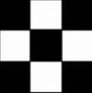
unsharp|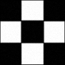
laplace|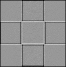
sobel|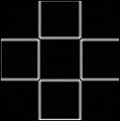
canny|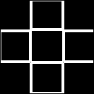

操作|test4
--|--
原图|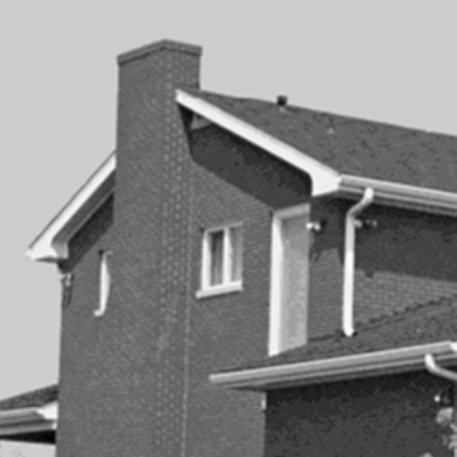
unsharp|
laplace|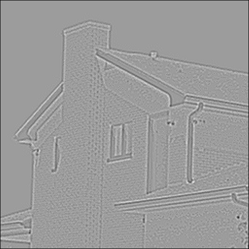
sobel|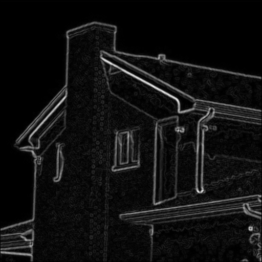
canny|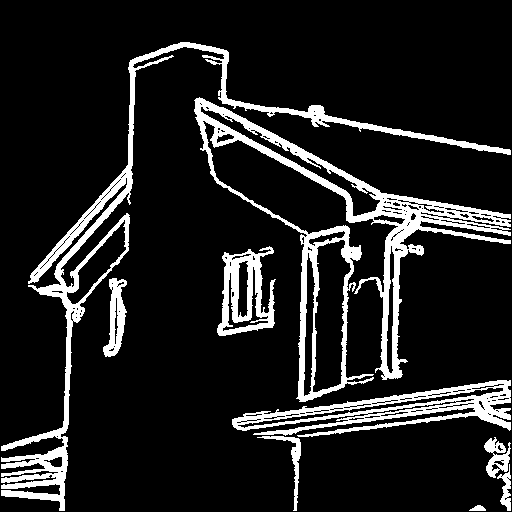

* unsharp可以起到锐化效果，laplace法（的绝对值）与sobel半斤八两，经过canny算法可以很好地得到图像中的边界。